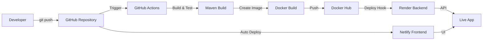

# 🚀 CI/CD Enabled Full Stack Application

<div align="center">


**A production-ready full-stack task management application demonstrating modern DevOps practices with automated CI/CD pipeline**

[Live Demo](#-live-demo) • [Features](#-features) • [Tech Stack](#-tech-stack) • [Getting Started](#-getting-started) • [Documentation](#-documentation)

</div>

---

## 📋 Table of Contents

- [About](#-about-the-project)
- [Live Demo](#-live-demo)
- [Features](#-features)
- [Tech Stack](#-tech-stack)
- [Architecture](#-architecture)
- [Project Structure](#-project-structure)
- [CI/CD Pipeline](#-cicd-pipeline-flow)
- [Getting Started](#-getting-started)
- [Environment Variables](#-environment-variables)
- [API Documentation](#-api-documentation)
- [Deployment](#-deployment)
- [Screenshots](#-screenshots)
- [Contributing](#-contributing)
- [License](#-license)
- [Contact](#-contact)

---

## 🎯 About The Project

This project demonstrates a complete **DevOps workflow** by building a full-stack web application with an **automated CI/CD pipeline**. The focus is on deployment infrastructure and industry-standard practices used in real software engineering teams worldwide.

The application is a **Task Management Dashboard** - a clean, minimal web app where users can create, view, complete, and delete tasks. The simplicity is intentional, keeping the spotlight on the **DevOps pipeline, containerization, and automated deployment**.

### 🎓 Learning Objectives

- ✅ Understand and implement **Docker containerization**
- ✅ Build and configure **CI/CD pipelines** with GitHub Actions
- ✅ Deploy applications to **cloud platforms** (Netlify, Render)
- ✅ Work with **RESTful APIs** and full-stack integration
- ✅ Gain hands-on experience with the **complete software delivery lifecycle**

---

## 🌐 Live Demo

| Service | URL | Status |
|---------|-----|--------|
| **Frontend** | [https://cicdfs.netlify.app](https://cicdfs.netlify.app) | 🟢 Live |
| **Backend API** | [https://task-manager-backend-47tp.onrender.com/api/tasks](https://task-manager-backend-47tp.onrender.com/api/tasks) | 🟢 Live |
| **GitHub Repo** | [View Repository](https://github.com/Harsh13912/cicd-enabled-fullstack-project) | 📦 Public |

> **Note:** Backend may take 30-60 seconds to wake up on first request (free tier limitation)

---

## ✨ Features

### 🎨 Frontend (React)
- Modern, responsive UI with glassmorphism design
- Dark gradient theme with smooth animations
- Real-time task management (Create, Read, Update, Delete)
- Loading states and error handling
- Interactive CI/CD testing guide panel
- Mobile-responsive layout

### ⚙️ Backend (Spring Boot)
- RESTful API with 4 endpoints
- H2 in-memory database (zero setup required)
- CORS configuration for cross-origin requests
- Exception handling and validation
- Containerized with Docker

### 🔄 DevOps
- **Automated CI/CD pipeline** with GitHub Actions
- **Docker containerization** for consistent environments
- **Multi-stage builds** for optimized images
- **Cloud deployment** to Netlify and Render
- **Zero-downtime deployments**

---

## 🛠️ Tech Stack

### Frontend


### Backend


### DevOps & Deployment


---

## 🏗️ Architecture

### System Architecture Diagram

```
┌─────────────────────────────────────────────────────────────────┐
│                         USER INTERFACE                          │
│                    (Browser / Mobile App)                       │
└────────────────────────┬────────────────────────────────────────┘
                         │
                         │ HTTPS
                         ▼
┌─────────────────────────────────────────────────────────────────┐
│                    FRONTEND (React + Vite)                      │
│                    Hosted on Netlify                            │
│   ┌────────────────────────────────────────────────────────┐    │
│   │  • Task Manager UI                                     │    │
│   │  • Axios API Client                                    │    │
│   │  • CI/CD Guide Panel                                   │    │
│   └────────────────────────────────────────────────────────┘    │
└────────────────────────┬────────────────────────────────────────┘
                         │
                         │ REST API (HTTP/JSON)
                         ▼
┌─────────────────────────────────────────────────────────────────┐
│              BACKEND (Spring Boot + Docker)                     │
│                    Hosted on Render                             │
│   ┌────────────────────────────────────────────────────────┐    │
│   │  REST Controller (TaskController)                      │    │
│   │         │                                              │    │
│   │         ├─ GET    /api/tasks                           │    │
│   │         ├─ POST   /api/tasks                           │    │
│   │         ├─ DELETE /api/tasks/{id}                      │    │
│   │         └─ PUT    /api/tasks/{id}/toggle               │    │
│   └─────────┬──────────────────────────────────────────────┘    │
│             │                                                   │
│   ┌─────────▼──────────────────────────────────────────────┐    │
│   │  Service Layer (Business Logic)                        │    │
│   └─────────┬──────────────────────────────────────────────┘    │
│             │                                                   │
│   ┌─────────▼──────────────────────────────────────────────┐    │
│   │  Repository (JPA / Spring Data)                        │    │
│   └─────────┬──────────────────────────────────────────────┘    │
│             │                                                   │
│   ┌─────────▼──────────────────────────────────────────────┐    │
│   │  H2 In-Memory Database                                 │    │
│   │  (Clears on restart - Demo purpose)                    │    │
│   └────────────────────────────────────────────────────────┘    │
└─────────────────────────────────────────────────────────────────┘

┌─────────────────────────────────────────────────────────────────┐
│                      CI/CD PIPELINE                             │
│                                                                 │
│  GitHub ──► Actions ──► Docker Build ──► Docker Hub ──► Render  │
│                    └──► Netlify Deploy                          │
└─────────────────────────────────────────────────────────────────┘
```

### Three-Tier Architecture

| Layer | Technology | Responsibility | Deployment |
|-------|------------|----------------|------------|
| **Presentation** | React + Vite | User Interface, API calls | Netlify (Static) |
| **Application** | Spring Boot (Java 17) | REST APIs, Business logic | Render (Container) |
| **Data** | H2 In-Memory | Data persistence | Embedded in Backend |

---

## 📁 Project Structure

```
cicd-fullstack-app/
│
├── 📂 frontend/                     # React Frontend Application
│   ├── 📂 src/
│   │   ├── 📂 components/
│   │   │   ├── TaskForm.jsx         # Task creation form component
│   │   │   ├── TaskForm.css
│   │   │   ├── TaskList.jsx         # Task list display component
│   │   │   ├── TaskList.css
│   │   │   ├── CICDGuide.jsx        # CI/CD testing guide panel
│   │   │   └── CICDGuide.css
│   │   ├── 📂 services/
│   │   │   └── taskService.js       # Axios API service
│   │   ├── App.jsx                  # Main application component
│   │   ├── App.css
│   │   ├── main.jsx                 # Entry point
│   │   └── index.css                # Global styles
│   ├── index.html                   # HTML template
│   ├── package.json                 # NPM dependencies
│   ├── vite.config.js              # Vite configuration
│   ├── netlify.toml                # Netlify deployment config
│   ├── Dockerfile                  # Frontend Docker image
│   └── nginx.conf                  # Nginx server config
│
├── 📂 backend/                      # Spring Boot Backend Application
│   ├── 📂 src/main/
│   │   ├── 📂 java/com/devops/taskmanager/
│   │   │   ├── 📂 controller/
│   │   │   │   └── TaskController.java      # REST API endpoints
│   │   │   ├── 📂 model/
│   │   │   │   └── Task.java               # JPA Entity
│   │   │   ├── 📂 repository/
│   │   │   │   └── TaskRepository.java     # JPA Repository
│   │   │   ├── 📂 config/
│   │   │   │   └── CorsConfig.java         # CORS configuration
│   │   │   └── TaskManagerApplication.java # Main Spring Boot class
│   │   └── 📂 resources/
│   │       └── application.properties      # App configuration
│   ├── pom.xml                     # Maven dependencies
│   └── Dockerfile                  # Backend Docker image
│
├── 📂 .github/workflows/            # CI/CD Pipeline
│   └── backend-deploy.yml          # GitHub Actions workflow
│
├── docker-compose.yml              # Local development setup
├── .gitignore                      # Git ignore rules
└── README.md                       # This file
```

---

## 🔄 CI/CD Pipeline Flow

### Automated Deployment Workflow



### Pipeline Stages

| Stage | Action | Tool | Duration |
|-------|--------|------|----------|
| **1. Code Push** | Developer pushes to `main` branch | Git | Instant |
| **2. Trigger** | GitHub Actions workflow starts | GitHub Actions | ~5 sec |
| **3. Checkout** | Clone repository code | Actions Runner | ~10 sec |
| **4. Build** | Compile Java code with Maven | Maven | ~1-2 min |
| **5. Docker Build** | Create container image | Docker | ~2-3 min |
| **6. Push Image** | Upload to Docker Hub | Docker Hub | ~30 sec |
| **7. Deploy Backend** | Render pulls new image and redeploys | Render | ~2-3 min |
| **8. Deploy Frontend** | Netlify builds and deploys React app | Netlify | ~1-2 min |
| **9. Live** | Application accessible via public URLs | ☁️ Cloud | ✅ |

**Total Time:** ~5-10 minutes from push to live deployment

---

## 🚀 Getting Started

### Prerequisites

Before you begin, ensure you have the following installed:

- **Java JDK 17+** - [Download](https://adoptium.net/)
- **Node.js 18+** - [Download](https://nodejs.org/)
- **Docker Desktop** - [Download](https://www.docker.com/products/docker-desktop)
- **Git** - [Download](https://git-scm.com/)
- **Maven 3.9+** - [Download](https://maven.apache.org/) (or use Maven wrapper)

Verify installations:
```bash
java -version    # Should show Java 17+
node -v          # Should show v18+
docker --version # Should show Docker version
git --version    # Should show Git version
```

### Installation

#### Option 1: Run with Docker Compose (Recommended)

1. **Clone the repository**
   ```bash
   git clone https://github.com/YOUR_USERNAME/cicd-fullstack-app.git
   cd cicd-fullstack-app
   ```

2. **Start all services**
   ```bash
   docker-compose up --build
   ```

3. **Access the application**
   - Frontend: http://localhost:3000
   - Backend API: http://localhost:8080/api/tasks
   - H2 Console: http://localhost:8080/h2-console

4. **Stop services**
   ```bash
   docker-compose down
   ```

#### Option 2: Run Manually (Development)

**Backend:**
```bash
cd backend
mvn spring-boot:run
# Backend runs on http://localhost:8080
```

**Frontend:**
```bash
cd frontend
npm install
npm run dev
# Frontend runs on http://localhost:3000
```

---

## 🔐 Environment Variables

### Frontend (.env)

Create a `.env` file in the `frontend/` directory:

```env
VITE_API_URL=http://localhost:8080
```

For production (Netlify):
```env
VITE_API_URL=https://your-backend.onrender.com
```

### Backend (application.properties)

Located in `backend/src/main/resources/application.properties`:

```properties
# Server Configuration
server.port=8080

# H2 Database
spring.datasource.url=jdbc:h2:mem:taskdb
spring.datasource.username=sa
spring.datasource.password=

# JPA Configuration
spring.jpa.hibernate.ddl-auto=update
spring.jpa.show-sql=true

# H2 Console (Development only)
spring.h2.console.enabled=true
spring.h2.console.path=/h2-console
```

---

## 📡 API Documentation

### Base URL
```
Development: http://localhost:8080/api
Production:  https://your-app.onrender.com/api
```

### Endpoints

#### 1. Get All Tasks
```http
GET /api/tasks
```

**Response:**
```json
[
  {
    "id": 1,
    "title": "Complete project documentation",
    "description": "Write comprehensive README",
    "completed": false,
    "createdAt": "2024-01-15T10:30:00"
  }
]
```

#### 2. Create Task
```http
POST /api/tasks
Content-Type: application/json

{
  "title": "New Task",
  "description": "Task description"
}
```

**Response:**
```json
{
  "id": 2,
  "title": "New Task",
  "description": "Task description",
  "completed": false,
  "createdAt": "2024-01-15T10:35:00"
}
```

#### 3. Delete Task
```http
DELETE /api/tasks/{id}
```

**Response:** `204 No Content`

#### 4. Toggle Task Completion
```http
PUT /api/tasks/{id}/toggle
```

**Response:**
```json
{
  "id": 1,
  "title": "Complete project documentation",
  "description": "Write comprehensive README",
  "completed": true,
  "createdAt": "2024-01-15T10:30:00"
}
```

### Error Responses

```json
{
  "timestamp": "2024-01-15T10:40:00",
  "status": 404,
  "error": "Not Found",
  "message": "Task not found with id: 999",
  "path": "/api/tasks/999"
}
```

---

## 🚢 Deployment

### Deploy to Production

#### Frontend (Netlify)

1. **Connect Repository**
   - Login to [Netlify](https://netlify.com)
   - Click "Add new site" → "Import an existing project"
   - Connect your GitHub repository

2. **Configure Build Settings**
   ```
   Base directory: frontend
   Build command: npm run build
   Publish directory: frontend/dist
   ```

3. **Add Environment Variable**
   ```
   Key: VITE_API_URL
   Value: https://your-backend.onrender.com
   ```

4. **Deploy**
   - Netlify auto-deploys on every push to `main`

#### Backend (Render)

1. **Login to Docker Hub**
   ```bash
   docker login
   ```

2. **Build and Push Image**
   ```bash
   docker build -t YOUR_USERNAME/task-manager-backend:latest ./backend
   docker push YOUR_USERNAME/task-manager-backend:latest
   ```

3. **Create Web Service on Render**
   - Go to [Render Dashboard](https://render.com)
   - Click "New +" → "Web Service"
   - Select "Deploy an existing image"
   - Image URL: `YOUR_USERNAME/task-manager-backend:latest`

4. **Configure Service**
   - Instance Type: Free
   - Environment Variable: `SPRING_PROFILES_ACTIVE=prod`

5. **Get Deploy Hook**
   - Settings → Deploy Hook → Copy URL
   - Add to GitHub Secrets as `RENDER_DEPLOY_HOOK_URL`

#### GitHub Secrets Setup

Add these secrets in GitHub Settings → Secrets and variables → Actions:

| Secret Name | Description |
|-------------|-------------|
| `DOCKER_USERNAME` | Your Docker Hub username |
| `DOCKER_PASSWORD` | Docker Hub password/token |
| `RENDER_DEPLOY_HOOK_URL` | Render deploy webhook URL |

---

## 📸 Screenshots

### Main Dashboard


### CI/CD Guide Panel


### Mobile Responsive


---

## 🤝 Contributing

Contributions are what make the open-source community such an amazing place to learn, inspire, and create. Any contributions you make are **greatly appreciated**.

### How to Contribute

1. **Fork the Project**
   ```bash
   # Click the 'Fork' button on GitHub
   ```

2. **Clone Your Fork**
   ```bash
   git clone https://github.com/YOUR_USERNAME/cicd-fullstack-app.git
   cd cicd-fullstack-app
   ```

3. **Create a Feature Branch**
   ```bash
   git checkout -b feature/AmazingFeature
   ```

4. **Make Your Changes**
   - Write clean, documented code
   - Follow existing code style
   - Add tests if applicable

5. **Commit Your Changes**
   ```bash
   git add .
   git commit -m 'Add some AmazingFeature'
   ```

6. **Push to Your Fork**
   ```bash
   git push origin feature/AmazingFeature
   ```

7. **Open a Pull Request**
   - Go to the original repository
   - Click "New Pull Request"
   - Describe your changes

### Development Guidelines

- Follow the existing code structure
- Write meaningful commit messages
- Test your changes locally before pushing
- Update documentation if needed
- Be respectful and constructive in discussions

---

## 📄 License

This project is licensed under the **MIT License** - see the [LICENSE](LICENSE) file for details.

```
MIT License

Copyright (c) 2024 YOUR_NAME

Permission is hereby granted, free of charge, to any person obtaining a copy
of this software and associated documentation files (the "Software"), to deal
in the Software without restriction, including without limitation the rights
to use, copy, modify, merge, publish, distribute, sublicense, and/or sell
copies of the Software...
```

---

## 📞 Contact

**GitHub Profile:** [https://github.com/Harsh13912](https://github.com/Harsh13912)

**Project Link:** [https://github.com/Harsh13912/cicd-enabled-fullstack-project](https://github.com/Harsh13912/cicd-enabled-fullstack-project)

**LinkedIn:** [Your LinkedIn](https://linkedin.com/in/your-profile)

**Email:** 23bcs13912@gmail.com

---

## 🙏 Acknowledgments

This project was built as a learning exercise in modern DevOps practices. Special thanks to:

- [Spring Boot Documentation](https://spring.io/projects/spring-boot)
- [React Documentation](https://react.dev)
- [Docker Documentation](https://docs.docker.com)
- [GitHub Actions Documentation](https://docs.github.com/en/actions)
- [Netlify Documentation](https://docs.netlify.com)
- [Render Documentation](https://render.com/docs)

### Useful Resources

- [Spring Initializr](https://start.spring.io/) - Bootstrap Spring Boot projects
- [Vite](https://vitejs.dev/) - Next generation frontend tooling
- [Docker Hub](https://hub.docker.com/) - Container registry
- [H2 Database](https://www.h2database.com/) - In-memory database
- [Axios](https://axios-http.com/) - Promise-based HTTP client

---

## ⭐ Star This Repository

If you found this project helpful or learned something from it, please consider giving it a ⭐ star on GitHub! It helps others discover this project and motivates me to create more educational content.

### Quick Star Guide

1. Click the **Star** button at the top right of this page
2. Share this project with others who might find it useful
3. Follow me on GitHub for more projects

**Your support means a lot! Thank you! 🙏**

---

## 🎓 What I Learned

Building this project taught me:

- ✅ How to containerize full-stack applications with Docker
- ✅ Setting up automated CI/CD pipelines with GitHub Actions
- ✅ Deploying to cloud platforms (Netlify, Render)
- ✅ Building RESTful APIs with Spring Boot
- ✅ Creating modern UIs with React and Vite
- ✅ Managing environment configurations across environments
- ✅ Working with in-memory databases
- ✅ Implementing CORS for cross-origin requests
- ✅ Writing professional documentation

This project serves as a strong portfolio piece demonstrating practical DevOps skills applicable in real-world software engineering roles.

---

## 🔮 Future Enhancements

Potential improvements for this project:

- [ ] Add user authentication with JWT
- [ ] Switch to PostgreSQL for persistent data
- [ ] Implement task categories and tags
- [ ] Add task due dates and reminders
- [ ] Create admin dashboard
- [ ] Add unit and integration tests
- [ ] Implement search and filter functionality
- [ ] Add task priorities (High/Medium/Low)
- [ ] Create mobile apps (React Native)
- [ ] Add real-time updates with WebSockets
- [ ] Implement dark/light theme toggle
- [ ] Add data export functionality (CSV, PDF)
- [ ] Create API rate limiting
- [ ] Add monitoring and logging (Sentry, LogRocket)
- [ ] Implement caching with Redis

---

<div align="center">

### Made with ❤️ and lots of ☕

**Thank you for checking out this project!**

[⬆ Back to Top](#-cicd-enabled-full-stack-application)

---

[](https://github.com/YOUR_USERNAME)
[](https://github.com/YOUR_USERNAME/cicd-fullstack-app)
[](https://github.com/YOUR_USERNAME/cicd-fullstack-app)

</div>
